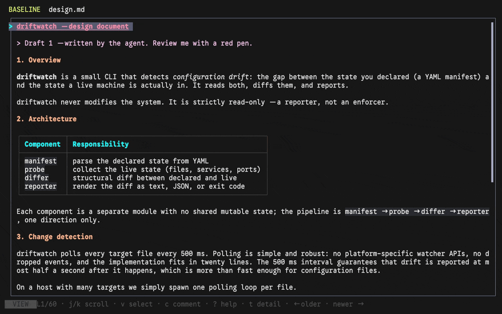

# akapen

**akapen**（赤ペン, "red pen") — mark up your agent's documents, right from the terminal.

日本語版 README は [README.ja.md](README.ja.md) にあります。

Your agent wrote a design document. Three sections are wrong, one example is misleading, and chapter 5's tone is off. Your options: write a long prompt explaining all of it (the agent will get the gist), or annotate the file by hand in an editor (the line numbers travel, but the editor wasn't built for this).

akapen is that annotation, in the terminal: select lines, attach comments, and send them straight to the agent — briskly, without leaving the document.

akapen never fixes the document — it gets it fixed. Writing a comment on the line: the most direct indirect edit there is.



*Two review rounds in 60 seconds: mark → send → ⚡ → check, then `Tab` for the source diff and `←` to travel back through every draft the agent ever produced. Scripted and reproducible — see [examples/demo](examples/demo).*

## The loop

```
agent writes → you read → you mark → s sends → agent revises → ⚡ → r loads → you check
```

Read markdown beautifully rendered, select lines, attach comments, and send them to your coding agent — without leaving the document. When the agent edits the file, akapen notices (`⚡`); the new draft arrives with green marks where things changed and red marks where things were deleted. Walk the differences with `n`/`N`, and comment anything still wrong. Your files are never modified: comments leave through the clipboard, stdout, or your send command.

## The document time machine

A review is only fair if you can check what actually got fixed. akapen keeps **every draft the agent ever produced** — Git commits and bounded LOCAL snapshots share one timeline — and you can browse them, still rendered, with `Left`/`Right`. The review baseline pins *the version you reviewed*; green/red marks compare that baseline with whichever draft you're looking at. Comments are pinned to the exact draft they describe, and carry the revision with them. Git is optional.

Prefer an older version of a section? Walk back, comment — *"this draft was better"* — and the revision plus the historical text arrive with the comment, so the agent can restore precisely that version.

## The red pen

- **Two modes, one cursor**: view mode renders Markdown natively — width-adaptive tables that shrink instead of truncating, headings, code blocks, links, footnotes, math, task lists — while source mode shows line-numbered raw source with syntax highlighting (100+ languages), wrapping with gutter-aligned indentation. Selection and comments work identically in both.
- **Comment anywhere**: `v` to select, `c` to comment; comments appear as inline cards right under the lines they refer to.
- **Reply mode**: `--reply` turns akapen into a red pen for the agent's *chat output* — the code examples and markdown it pasted into the conversation, which never touched a file.
- **Session mode, always**: one file or twenty, `]`/`[` to switch; cursor, selection, and mode are remembered per file.
- **Terminal-native**: plain ANSI chrome that follows your palette, two-face syntax themes (32 built-ins or any `.tmTheme`), light/dark auto-detect via OSC 11, CJK-correct width math.

## Try it

```sh
cargo install akapen
ashiato . --open-cmd "akapen {} --send-agent"   # picker → open → send comments back
```

`herdr plugin link <this repo>` registers the `akp.open` actions — open akapen on the agent's latest chat messages straight from the command palette.

Based on the line-comment experience of [herdr-reviewr](https://github.com/persiyanov/herdr-reviewr), reworked for markdown-first reading in a single-pane, two-mode design.

## Install

```sh
cargo install akapen
```

Or from source:

```sh
cargo build --release
# binary: target/release/akapen
```

No external binaries required — rendering is built in. On macOS the optional IME helper is compiled once with `swiftc` (auto-disabled if unavailable). The same helper doubles as a standalone input-source CLI (`ime get|list|abc|jp|set <id>|watch <abc|jp> --app <bundle-id>|guard <abc|jp> --app <bundle-id>`) for focus watchers, sticky-ASCII guards, and plugin wrappers — install with `scripts/install-ime.sh`, see the Japanese README for herdr/plugin integration recipes.

## Usage

```
akapen <file...> [--send-cmd <cmd> | --send-agent] [--reply] [--theme <name>]
                 [--ime <off|ascii|jp>] [--light|--dark] [--callback <cmd>]
                 [--esc-quit <auto|always|never>] [--no-fx]
```

| Flag | Meaning |
|---|---|
| `--send-cmd <cmd>` | `s` pipes the formatted export to this shell command's stdin |
| `--send-agent` | `s` sends to the sole herdr agent in the current tab (needs `herdr` on PATH) |
| `--reply` | reply mode: export as `> quote` + comment (no file/line references), auto-reload on external change, no diff — see [Reply mode](#reply-mode--mark-up-the-agents-chat-output-akp) |
| `--theme <name>` | two-face theme name (default `Catppuccin Mocha`; `Solarized (light)` when light is detected) or a path to a `.tmTheme` file |
| `--ime <off\|ascii\|jp>` | macOS input-source control around the comment composer (default `ascii`) |
| `--light` / `--dark` | force the UI palette (default: auto-detect the terminal background via OSC 11) |
| `--no-fx` | disable the tachyonfx animations: the rotating purple→cyan gradient frame while browsing the past, and the toast fade-in/out (the static history border color and instant toasts stay) |
| `--callback <cmd>` | shell command spawned on exit (e.g. return to a file picker) |
| `--esc-quit <auto\|always\|never>` | whether `Esc` may quit (default `auto`: only with `--callback`; `always` = unconditionally, `never` = Esc stays a pure cancel) |

Typical loop with a picker (see the companion tool [ashiato](https://github.com/worldnine/ashiato), an mtime-sorted file picker):

```sh
ashiato . --open-cmd "akapen {} --send-agent"
```

## Keys

| Key | Action |
|---|---|
| `Left` / `Right` (view / source) | select an older / newer document from oldest `1/N` to present `NOW N/N`; input scrubs the bottom timeline bar and its floating readout, then the final Markdown renders after 300ms idle |
| `t` | open the timeline generation list (browsing also shows a bottom timeline bar: ◆ current `HERE` / ▮ baseline / ● LOCAL / ◼ COMMIT) |
| `Tab` | toggle view ⇄ source (selection carries over; non-markdown files are source-only) |
| `j` / `k` | move cursor (extends the range while selecting) |
| `J` / `K`, `Shift+↓` / `Shift+↑` | select and move in one key: anchor on the cursor line if nothing is selected, then extend (Shift+arrows need a terminal that reports them) |
| `g` / `G`, `PgUp` / `PgDn`, `Ctrl+u` / `Ctrl+d` | jump / half-page moves |
| `v` | start selecting lines (anchor; `j`/`k` then extend) |
| `c` | comment the selection (or the cursor line); re-selecting an existing comment's exact range edits it |
| `n` / `N` | center the next / previous difference from the review baseline |
| `]` / `[` | next / previous file in the session |
| `?` | key reference |
| `r` / `i` | on external change: reload / ignore |
| `a` | acknowledge NOW, or set the displayed historical generation as the review baseline; clears selection |
| `F7` / `Shift+F7` | alternate next / previous review-mark keys (`]c` / `[c`, `Alt+j` / `Alt+k` also work) |
| `Ctrl+n` / `Ctrl+p` | jump to the next / previous comment (moved from `n` / `N`) |
| `Ctrl+o` | file picker (moved from `Ctrl+p`) |
| `l` | all-comments overlay (`y` copies all comments, `s` sends them, `d` deletes one) |
| `e` | edit the file in `$EDITOR` (suspends the TUI, reloads and acknowledges your own edit on return; blocked while a file change is pending — `r` first). Opens at the cursor line — or the selection's start — via the `+N FILE` convention for editors that support it (vi/vim/nvim, nano, emacs, micro) |
| `y` | copy the selection (or the cursor line) **as displayed**: rendered text in view mode, raw Markdown in source mode — Tab first for the Markdown. Wrapped rows are unwrapped. Copying the comments moved to the comments overlay (`l`, then `y`) |
| `s` | send via `--send-cmd` / `--send-agent` (comments are cleared only on success) |
| `d` | delete the comment under the cursor |
| `q` | quit (confirms if there are unsent comments) |
| `Esc` | cancel input / clear selection (never switches modes). With `--esc-quit` enabled it also quits like `q` — but only when nothing is pending (confirmation still guards unsent comments, and the prompt advertises `Esc/q to quit`) |

Mouse: wheel scrolls the view without moving the cursor; click moves the cursor; drag selects a line range; click the title-bar path to copy the full path; click `1/3 files` or the `▌ N` counter to open the overlays.

## The time machine, in detail

akapen treats every version as a complete document. Git commits and bounded LOCAL snapshots share one timeline; Git is optional. Browsing feels like the draft is alive: as you hold `Left`/`Right`, each settled generation change plays as two phases — removed lines first backspace away right→left as dim ghosts and the layout folds shut, then changed lines stream in left→right like an LLM, materializing in their final positions so nothing moves after appearing. History effects use neutral brightness, never add/delete colors, and the page frame changes while you are in the past.

1. Read and comment on the rendered document or its source.
2. When an agent edits the file, akapen shows `⚡`. Press `r` to load the new complete version.
3. The title shows `! N`; green `▌` marks present/changed locations. Deletions show as red `▀` position marks in view mode, while **source mode renders the deleted lines themselves inline** — red `▌` gutter on a full-row red band (the diff-pair partner of the green `▌` band), blank line number — including the old text of rewritten lines (a diff against the baseline). The `▌` mark repeats on every wrapped row of a changed or deleted line, so the left-edge mark column never breaks — a wrapped change or a run of adjacent changes reads as one solid band. Feel the change in view mode, then Tab into source mode to inspect it precisely. Use `n` / `N` to visit the differences; landing on a pure deletion **focuses** its deleted rows (bright red, no misleading selection on the untouched line below) and `c` then comments the deletion, quoting the deleted baseline text.
4. Repeated reloads accumulate review marks without moving the baseline. Press `a` at NOW to acknowledge them, or press `a` on a historical LOCAL/COMMIT generation to choose that generation as the baseline.

`Left` / `Right` move through the unified timeline while keeping Markdown rendered. Holding an arrow scrubs the bottom timeline bar immediately and renders once input settles — the axis marks ◆ the displayed generation (`HERE`, with `NOW` at the right edge), ▮ the review baseline, ● LOCAL snapshots and ◼ COMMITs; it is dim left of the baseline (reviewed history) and normal from the baseline to NOW (the unreviewed stretch), and in view mode it replaces the frame's bottom border so no content rows are lost. Each step shows a readout band on the row above the axis, riding over the ◆ as you scrub and clamped to the screen edges — provenance glyph, short id, relative age (`2h ago`), and the commit summary (`BASELINE · ` when the point is the baseline) — which dissolves once you settle; the title keeps only a tiny `◆ 3/7` position badge (the fallback on terminals too narrow for the bar). `t` opens the full generation list. Git commits whose content matches a LOCAL snapshot are shown once as COMMIT.

The baseline needs no words of its own: the yellow ▮ marker and the dim reviewed stretch carry it, and the footer keeps only the `← older · newer →` navigation. While you are in the past, the frame's border runs a rotating purple→cyan gradient (`--fx`, the default) — the time machine is unmissable; `--no-fx` restores the static history border color. Green/red marks compare that fixed baseline with whichever generation is displayed, in both directions through the timeline; browsing those comparisons never changes the unreviewed state at NOW.

LOCAL snapshots are content-addressed, gzip-compressed, and stored outside the repository under the user cache directory. The cache keeps at most 32 generations per file and 256 MiB globally while protecting NOW, the review baseline, unreviewed generations, and generations carrying comments. **The timeline order is lineage-based**: each LOCAL records the HEAD commit it was observed under (its parent oid) and is placed right after that commit, so commits made by the agent mid-review never invert the order. LOCALs whose parent matches no commit in the current history (rebase, foreign branch, non-git) fall back to the documented observation-order placement above Git. Review marks are line-granular everywhere — a one-cell table edit marks one row, a one-line paragraph edit marks one line, never the whole block. Non-Markdown UTF-8 files use the same timeline and review model in source mode, also with line-granularity marks.

Comments stay attached to the exact generation they describe when `r` loads a newer file. Comment export contains the revision (for historical generations), resolved absolute file path, line range, quoted source, and the comment—never a diff or hunk.

While the comment composer is open, change detection is suspended so the document is never replaced while you type.

## Output format

One comment = optional historical revision + location + line-numbered snippet + body, reviewr-compatible. Blocks are sorted by file and start line, separated by a single blank line:

```
path/to/file.md:12-14
12: text of line 12
13:
14: text of line 14
comment body
```

Each snippet line is prefixed with its real line number, so blank lines inside a selection (`13: `) never collide with the blank lines that separate blocks.

## Sending

`y` copies only. `s` delivers, in one of two ways:

**`--send-agent`** (herdr auto-resolve, recommended): finds the sole agent in the current herdr tab (falling back to the sole workspace agent) and sends via `herdr agent prompt <pane> <text>` with direct argv passing — comments containing `"` or `$` are safe.

**`--send-cmd <cmd>`** (generic): pipes the formatted text to the command's stdin.

```sh
akapen doc.md --send-cmd 'cat >> review.txt'      # append to a file
akapen %S --send-cmd 'xargs -0 -I{} herdr agent prompt wY:p1K {}'
```

On failure (non-zero exit) the comments are **kept** and can be re-sent; on success they are cleared.

### hunk integration

This is an external compatibility adapter only. akapen itself does not retain, display, or export hunks.

[hunk](https://github.com/modem-dev/hunk) reviews an agent's change set as diffs. The adapter [`scripts/akapen2hunk`](scripts/akapen2hunk) converts akapen's export into hunk live-session comments, so your line comments appear inline in hunk's diff view:

```sh
akapen doc.md --send-cmd 'akapen2hunk [--repo <root>] [--focus]'
```

## Reply mode — mark up the agent's chat output (akp)

`--reply` turns akapen into a quick red-pen for the agent's *conversation* output — the code examples and markdown the agent pasted into chat, which never touch a file:

```sh
akapen ... --send-agent --reply
```

- **Export format**: the file/line references are dropped and the selected snippet is quoted GitHub-style (`> ` lines); the comment sits on its own line after a blank line (the blank line keeps the comment out of the blockquote — CommonMark lazy continuation). Batches of comments are numbered (`1. > quote` + indented comment), so the receiving agent reads them as a list of distinct points to address in order. The number sits before the `> ` marker, so quoted content that itself contains list markers can never collide.
- **Auto-reload, no diff**: the document reloads automatically when it changes on disk, and the reload skips the diff — in reply mode the doc is a single agent message, so every refresh replaces the whole content.
- **Reply-mode UI**: the title shows `reply` (not the temp path), `]`/`[` moves between the recent messages, `e` (edit) and the file picker are disabled. `y` copies the selected part of the agent's message as displayed (plain text); copying your comments is `l`, then `y`.

The companion script [`plugins/akp/scripts/akp`](plugins/akp/scripts/akp) builds the document set: it resolves the sole agent in the current herdr tab, extracts the most recent text-bearing assistant messages from the session transcript (pi/claude/codex JSONL located by session id, hermes SQLite), and opens akapen on them. Codex timestamp-prefixed rollout files and its `response_item` / `output_text` records are supported. Re-invoking refreshes the documents in place.

### herdr plugin

The repository hosts herdr plugins one per directory under [`plugins/`](plugins): `herdr plugin link <repo>/plugins/akp` registers the three actions — `akp.open` (bottom split), `akp.open-side` (side split), `akp.open-float` (session popup) — all selectable from the command palette; `herdr plugin link <repo>/plugins/ime` registers the per-pane input-source hooks (requires the `ime` CLI installed via `scripts/install-ime.sh`). Each placement toggles (one pane per tab; the pane closes itself when akapen exits) and splits relative to the tab's *agent* pane, not the focused pane.

Convention: herdr integration code lives in the tool's own repo as a plugin (`herdr plugin link`) — new integrations go there, not in `~/.local/bin`.

## Design

Design invariants and their rationale live in [docs/internals.md](docs/internals.md) (Japanese). [docs/README.md](docs/README.md) indexes every document — which one to read, who it is for, and whether it still describes the current code. Before changing anything, read [docs/gotchas.md](docs/gotchas.md): the places that break quietly when you touch them.

- Rust + [ratatui](https://ratatui.rs) 0.30. The event loop drains bursts (up to 64 events per frame) before drawing once — wheel-scroll storms stay smooth even on 70k-line files.
- view mode converts markdown to ratatui `Text` via a vendored, instrumented copy of tui-markdown that preserves source-line attribution, then wraps it with the same width logic as source mode. Cursor positions map exactly between modes.
- Comments live only in memory and the export channel; the file on disk is never written.

## License & credits

MIT License.

Portions are adapted from [herdr-reviewr](https://github.com/persiyanov/herdr-reviewr) (MIT, Copyright (c) 2026 Dmitry Persiyanov): the export block format, syntect line highlighting, the `path:start-end` location format, and the argument-parsing skeleton.

`third_party/tui-markdown` is a vendored copy of [tui-markdown](https://github.com/joshka/tui-markdown) 0.3.9 (MIT OR Apache-2.0, Josh McKinney), instrumented with source-line attribution for akapen. Upstream license texts are included in that directory.
