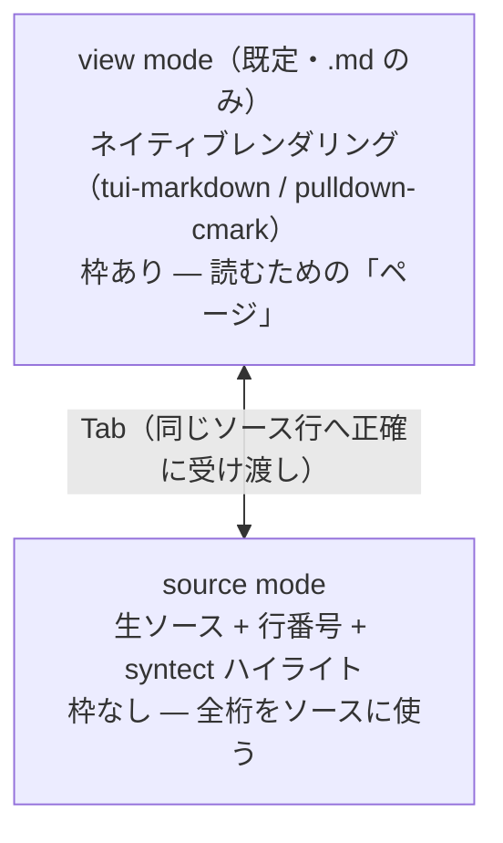

# akapen internals — 設計不変条件

現在の実装が守っている設計上の決定と、その理由。使い方は README、経緯は git 履歴の領分。
ここには「今も真であること」だけを現在形で書く。

## モードモデル

- モード名は操作ではなく**見えているもの**を指す（レンダリング済み = view / 生ソース = source）。
  コメントは両モードで付けられるので「comment モード」という名前にはしない。
- モード切替は **Tab の対称トグルのみ**。Esc は入力キャンセル / 選択解除だけで
  **モードを変えない**（反射的な Esc で読み位置が飛ぶのを防ぐ）。
  例外は `--esc-quit`（既定 `auto` = `--callback` 指定時のみ有効）: ペンディングが
  何もないとき Esc は q と同じく終了へ進み、確認プロンプト中は Esc が q と同じ
  「確定」になる（「Esc = 最上層を閉じる」の一貫性。overlay / 入力中は不変）。
- **枠線がモードの視覚シグネチャ**: view = 枠あり、source = 枠なし。
  タイトルバッジより強い手掛かりになる。

## 選択とコメントはモード非依存

- 選択は**単一の状態**で、Tab を跨いで引き継がれる。`v` / `c` / `n` / `N` /
  マウスドラッグは両モードで同じ操作・同じ粒度（ソース行単位）。
- view の `v` は、複数ソース行がマージされた段落では**段落頭の行**にアンカーする
  （ユーザーが「この行」と指すのは段落の先頭だから）。
- `n` / `N` のジャンプ先は**個々のコメント**（重なり・ネストしたコメントは別々のターゲットとして順に訪れ、着地時にそのコメントの範囲が選択される。同一範囲に積んだコメントは 1 ターゲットにまとまる）。
- コメントカードは両モードでインライン表示され、表示行レイアウトに組み込まれる
  （スクロール・カーソル追従・位置維持はカード込みで一貫する）。
- カーソル・選択の強調は DarkGray 背景（文字色不変）。`REVERSED` は使わない
  （syntect の色と反転が混ざると読みにくく、長時間の使用で疲れる）。

## 行マッピング（view ⇄ source の正確な受け渡し）

- レンダラが表示行 → ソース行の対応を保持し、view のカーソルは**ソース行そのもの**。
  モード切替は割合近似ではなく正確な行で受け渡す。
- 切替時はカーソル行の**画面上の行位置を維持**する（移行先のスクロールオフセットを
  逆算。先頭 / 末尾はクランプを許容）。
- **ゴースト表示**: view でレンダリングされない行（ref-def・フェンス・HTML）に
  カーソルか選択が触れたら、近くの空 row にソース原文を薄色（italic + Gray）で描く。
  描画は行の増減・reflow・マッピング変更を一切起こさない（レイアウト不変が要）。
  空 row が無ければ黙ってスキップ（best-effort が仕様）。
- **テーブル区切り行は空行と同じ扱い**: view の j/k は空行に加えてテーブル区切り行
  （`|---|---|`）もスキップする — 区切り行は情報を含まない（列数・配置・揃えは表本体が
  示す）。ref-def・フェンス・HTML は情報を持つので従来どおり停止 + ゴースト表示。
- **連続空行はランで 1 row**: view は markdown のプレビューでありソースの鏡ではない。
  ブラウザ / GitHub が連続空行を1つの段落区切りに折るのに合わせる。ランの先頭だけが
  row を持ち、残りは先頭の row を共有する（マージ段落と同じ共有 row 機構）。

## テーブルの幅適応レイアウト

- テーブルは常に**パン幅でレイアウト**される（`Options::max_width`、本番経路は `render()` の
  一本道で必ず `view_render_width` を渡す）。自然幅 + 固定オーバーヘッド（罫線・パディング）が
  パン幅に収まれば**バイト単位で不変**。収まらないときだけ列幅を縮小する。
- 列幅縮小は **最長の分割不能トークン幅を各列の下限**にした比例配分（Gemini CLI の
  fair allocation と同型）。CJK は表示幅（unicode-width）で測る。
- 幅制約でリレイアウトされたテーブルは、**本体行の間に区切り罫線**（ヘッダー区切りと同型）
  を入れて行境界を読めるようにする。自然幅のまま収まるテーブルはヘッダー区切りのみの
  軽い見た目を保つ（バイト単位で不変）。
- セル内容は列幅で**折り返して複数行**にし、罫線 `│` は全折り返し行に付ける。
  **トランケーションはしない**（レビューツールとして情報を隠さない）。列幅より広い
  トークンのみ、ワイド文字を割らない範囲で文字単位分割を許す。
- 折り返し行は**ソース行属性を引き継ぐ**（1ソース行 → 複数表示行の既存機構に乗るため、
  カーソル・コメント・行マッピングは壊れない）。
- テーブルの選択ハイライトは**セル内容だけ**に付く。罫線・パディング・区切り罫線行
  （ボックス描画文字のみの合成行 = フレーム）はカーソル/選択でもハイライトしない
  （フレームは構造であって内容ではない）。カーソル行は行の**全セル**がハイライトする。
  空行は従来どおり選択バンドに含まれる。
- リスト項目 / blockquote 内のテーブルは、継続インデント・引用プレフィックス幅を
  予算から差し引いてレイアウトする。
- 物理的限界（全列 1 表示列でも収まらない幅、available < 4n+1）ではビュー側の
  折り返しにフォールバックする。この幅では何をしても入らないため。
- `max_width` を渡し忘れると黙って自然幅に戻る（ライブラリ API の既定 = `None`）。
  幅が分からないライブラリ単体では自然幅が唯一の安全な既定なので、akapen 側で
  幅を必ず渡すこと（本番経路は `render()` 一本に集約されている）。

## 再読み込み

- 検知はイベントループ内で毎フレーム（~100ms）の mtime + size stat。通知は検知から
  **300ms のデバウンス後**（エージェントの非原子的書き込み対策）。
- **自動再読込はしない**。勝手に内容が入れ替わると、コメント作業中に選択クリアと
  アンカークランプが強制されるため。`r`（再読込）/ `i`（無視）でユーザーが選ぶ。
  **例外: リプライモード（`--reply`）は自動再読込する** — ドキュメントは akp が
  書き直す一時ファイルだけで、書き換え = 「エージェントの新着メッセージが届いた」
  という単一の意味しかないため。コメントは旧内容と一緒に破棄（送信済みか古いかの
  どちらか）。失敗時は ⚡ を出して手動 `r` に落とす（自動リトライ無限ループ防止）。
- `r` は行 diff（similar）で**変更行をハイライト**し（`+N/-M` バッジ）、
  現在ファイルのコメントをクリアする（旧内容への行番号アンカーは無効のため。
  他ファイルのコメントは無傷）。
- **composer が開いている間は通知を遅延する** — 検知（mtime+size のポーリング）は
  続くが、⚡ バッジとプロンプトは composer 終了後に出る。書きかけのコメントは絶対に壊さない。
- 書き込み途中の瞬間を掴んだら読み直しをスキップし、次の `r` で再試行する。

## セッション

- Session = 順序付きファイルリスト + ファイルごとの状態
  （カーソル・選択・view/source モード・変更検知スタンプ・コメント）。
- `]` / `[` の切替で**状態をファイルごとに保存・復元**する（カーソル・選択・
  モード・変更検知スタンプ・コメントすべて。選択もクリアされずに再訪時に戻る）。
- `s` 送信は**成功時のみ**コメントをクリアする。失敗（exit 非零）時は保持し、
  対象を直して再送できる。`q` の未送信確認もこの保持が前提。

## IME（macOS）

vim の IM 制御と同じ思想: コマンドモードは常に ASCII、composer だけ指定に従う。

| 状態 | 入力ソース |
|------|-----------|
| 起動時 | 現在値を保存 → ASCII に固定 |
| コマンドモード（view / source） | ASCII のまま |
| composer 中 | `--ime jp` なら日本語 / `ascii` なら非干渉 |
| composer クローズ | ASCII に戻す |
| 終了時 | 保存値を復元 |

- ヘルパは初回のみ swiftc でビルド（`~/.cache/akapen/ime`）。ビルド中は no-op に
  なるため、現れるまで数回リトライして ASCII を強制する。
- セッション中の手動切替（Cmd+Space）には追従しない（起動時 + composer クローズ時の
  2点で固定するだけ）。入力ソース切替がシステム全体に効くのは既知の制約
  （`--ime off` で回避）。
- 入力中はターミナルの実カーソルを隠し、挿入位置に `▏` を描画する。実カーソルを
  出さないため、日本語 IME の変換確定によるカーソルずれが起きない。

## イベントループ（回帰させないこと）

- **poll 1回 → 保留イベントを `MAX_EVENTS_PER_FRAME`(64) まで drain → 描画1回**。
  ホイール連射のバーストが1フレームに集約される。上限があるのでイベントの洪水でも
  描画が餓死しない（詳細は `src/main.rs` の `MAX_EVENTS_PER_FRAME` 周辺コメント）。
- view の描画は**可視ウィンドウのみ** O(viewport)。
- 「1イベント = 1フル描画」に戻す、または描画コストを O(文書) にする変更
  （全行を走査するレイアウト計算など）は、ホイール連射でのフリーズを即座に再発させる
  （実測: 120 連続ホイールイベントで 58.2 秒 → 0.58 秒に改善した経緯がある）。
- 再発時の切り分け: 「ゆっくりでも最終的に追いつく」= 配信遅延 /
  「永遠に追いつかない」= イベント消失。
- **入力は termtheme の読み手（`termtheme::input::poll` / `read`）だけで読む。**
  crossterm の `event::poll` / `event::read`・`cursor::position()`（ratatui の
  `Terminal::clear()` がこれを呼ぶ）を 1 か所でも足すと、読み手が 2 つになって端末を
  取り合い、配色の知らせ（モード 2031）を crossterm が読んだところで止まる
  （`docs/gotchas/terminal-keys.md`）。`NoBlinkBackend::get_cursor_position` は置いた
  位置を返し、端末に聞かない。
- **配色の知らせの購読**（`subscribe_color_scheme` / `unsubscribe_color_scheme`）は、
  外すのが終わるとき（`TerminalGuard` の Drop。panic の unwind も通る）とエディタに
  端末を渡すとき、張り直すのがエディタから戻ったとき（今の配色も問い合わせる）。
  `--light` / `--dark` では頼まない。知らせを受けたら `App::follow_color_scheme` が
  `light` から導いたもの（テーマの側・混ぜた色・UI の色・描画済みの行・色を抱えた
  演出）を作り直す。裏のファイルは `FileState::theme_stale` で開くときに塗り直す。

## 出力形式

- コメント1件 = location + **行番号付き**スニペット + 本文。スニペット各行に
  `12: ` を前置するのは、選択範囲内の空行とブロック区切りの空行を判別するため。
- location は `path:start-end`（単一行は `path:line`）。ファイル・開始行順にソートし、
  ブロック間は空行1つ（herdr-reviewr 互換）。
- ファイルは**一切書き換えない**。コメントはメモリと出力チャネル（クリップボード /
  stdout / send コマンド）にだけ存在する。

## リプライモード（`--reply` / plugins/akp/scripts/akp）

- **送信形式** = 引用 + 空行 + コメント。location と行番号を落とす（会話にファイル
  参照は無意味）。空行は必須: CommonMark の lazy continuation で、`> ` の直後の
  非空行は引用に取り込まれるため（pi / GitHub 同じ）。
- **バッチ送信の番号付け**: コメントが2件以上のとき、各ペアの**引用の前に** `N. `
  を付ける（`N. > 引用`）。番号を `> ` の前（引用内容が絶対に侵入できない位置）に
  置くのは、引用内容が `1. ` 等のリストマーカーを含んでも衝突しないため。コメントは
  4スペースインデントで番号付き項目の内側に入れる（引用⇄コメントのペアを1項目に
  閉じ込める）。受信エージェントは「順番に対応すべき個別指摘のリスト」と読む。
- **自動リロード・diff なし**: 前述の通り。diff をスキップするのは、ドキュメントが
  1メッセージ丸ごと置換されるため、常に「全行変化」になるから（ノイズ）。
- **ドキュメントはタブ安定パス**（`$TMPDIR/akp-<tab>-NN.md`、01 = 最新、ゼロ埋め）:
  再実行で上書きされ、起動中の akapen が自動リロードする。ゼロ埋めは送信順
  （ファイルパスでソート）を新しさ順に保つため。
