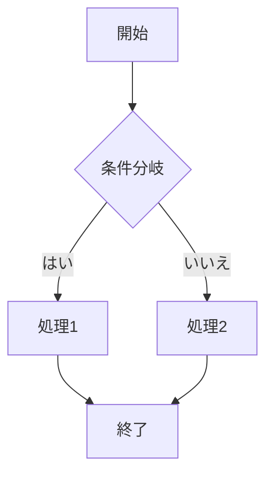

# 🚀 見出しレベル1 (H1)

見出しレベル 1〜6 の描画テスト。表・コード・画像の表示確認。

## 見出しレベル2 (H2)

### 見出しレベル3 (H3)

#### 見出しレベル4 (H4)

##### 見出しレベル5 (H5)

###### 見出しレベル6 (H6)

## 見出しに `インラインコード` と [リンク](https://example.com) が入るパターン

<!-- HTML コメントはレンダラで消えるはず。ソース上には残るので行コメント対象になる -->

## 段落とインライン書式

**太字**、*斜体*、***太字斜体***、~~打ち消し~~、`インラインコード`、
<sub>下付き</sub>、<sup>上付き</sup>、<mark>マーク</mark>、改行<br>タグ。

日本語の文章 + English mixed テスト。全角文字（あいうえお漢字カタカナ）と
半角英数字の混在で折り返しが崩れないことを確認するための長めの文章です。
この行はかなり長くて、画面幅を超えたときにコメントモードでの折り返しが
正しくインデントされるかを確認するためのものです。Lorem ipsum dolor sit
amet, consectetur adipiscing elit, sed do eiusmod tempor incididunt ut labore
et dolore magna aliqua. 記号 !@#$%^&*()_+{}|:"<>?`~-=[]\;',./ と数字 0123456789。

行末に半角スペース2つを置くと  
ハード改行になります。

タブ文字	が含まれる行。8桁タブストップで展開されるはず。

## リンク

インラインリンク: [GitHub](https://github.com)
タイトル付き: [example](https://example.com "example title")
参照スタイル: [reference][ref1]
自動リンク: <https://rust-lang.org>
メール自動リンク: <mailto:test@example.com>
相対リンク: [README](./README.md) と [design](design.md)
同一ファイル内アンカー: [先頭へ](#🚀-見出しレベル1-h1)
リンクの URL だけを並べた長い行: https://example.com/very/long/path/with/many/segments/abcdefghijklmnopqrstuvwxyz/1234567890?query=value&another=value#fragment

[ref1]: https://example.com/ref "参照リンクのタイトル"

## 画像

インライン画像（タイトル付き）:


参照スタイルの画像:

![参照画像][img1]

[img1]: https://placehold.co/300x200.png "参照画像タイトル"

画像リンク（画像をクリックでリンク先へ飛ぶやつ）:

[](https://example.com)

存在しない相対パスの画像:


SVG 画像:


HTML の img タグ（サイズ指定）:


## コードブロック

### フェンス付きコード (rust)

```rust
use std::collections::HashMap;

/// ドキュメントコメント付きのサンプル関数
fn main() -> Result<(), Box<dyn std::error::Error>> {
    let mut map: HashMap<String, Vec<u8>> = HashMap::new();
    map.insert("key".to_string(), vec![1, 2, 3]);

    for (k, v) in &map {
        println!("{k}: {v:?}  ← 日本語コメント");
    }

    // インラインの `コード` を含む行
    let s = "文字列の中に ``` や ` が入るパターン";
    Ok(())
}
```

### フェンス付きコード (python)

```python
def fibonacci(n: int) -> int:
    """フィボナッチ数列の計算"""
    a, b = 0, 1
    for _ in range(n):
        a, b = b, a + b
    return a

# 長い行のテスト: この行は意図的に非常に長くして、コメントモードでの折り返しと行番号ガターのインデントが揃うことを確認するためのものです
print(fibonacci(10))
```

### フェンス付きコード (javascript)

```javascript
// コメント
const handler = (req, res) => {
  const data = { ok: true, items: [1, 2, 3], name: "テスト" };
  res.json(data);
};

/* 複数行
   コメント */
export default handler;
```

### フェンス付きコード (bash)

```bash
#!/usr/bin/env bash
set -euo pipefail

for file in src/*.rs; do
  echo "processing $file"
  grep -n "TODO" "$file" || true
done
```

### フェンス付きコード (json)

```json
{
  "name": "akapen",
  "version": "0.1.0",
  "dependencies": {
    "ratatui": "^0.30",
    "mdcat": "^2"
  },
  "日本語キー": "日本語の値"
}
```

### フェンス付きコード (diff)

```diff
--- a/README.md
+++ b/README.md
@@ -1,5 +1,6 @@
 # akapen
+
+新しい行が追加された
```

### その他の言語いろいろ

```sql
SELECT id, name, created_at
FROM comments
WHERE user_id = 42
ORDER BY created_at DESC
LIMIT 10;
```

```html
<div class="card">
  <h2>タイトル</h2>
  <p>本文です</p>
  
</div>
```

```css
.card {
  display: flex;
  gap: 8px;
  padding: 16px;
}

@media (max-width: 600px) {
  .card { flex-direction: column; }
}
```

```toml
[package]
name = "akapen"
version = "0.1.0"
edition = "2021"
```

```yaml
name: akapen
version: 0.1.0
dependencies:
  - ratatui
  - mdcat
```

```go
package main

import "fmt"

func main() {
    fmt.Println("こんにちは、世界")
}
```

```c
#include <stdio.h>

int main(void) {
    /* コメント */
    printf("Hello, World!\n");
    return 0;
}
```

```cpp
#include <iostream>
#include <vector>

int main() {
    std::vector<int> v{1, 2, 3};
    for (auto x : v) {
        std::cout << x << std::endl;
    }
    return 0;
}
```

```typescript
interface User {
  id: number;
  name: string;
  tags: string[];
}

const user: User = { id: 1, name: "太郎", tags: ["a", "b"] };
```

```swift
import Foundation

struct Comment: Codable {
    let id: Int
    let text: String
}

let comments = try JSONDecoder().decode([Comment].self, from: data)
```

```ruby
class Greeter
  def initialize(name)
    @name = name
  end

  def greet
    puts "Hello, #{@name}!"
  end
end
```



### 言語指定なし（プレーン）

```
プレーンなコードブロック。ハイライトなし。
日本語も含む。タブ	入り。| パイプや * アスタリスク。
```

### インデントコードブロック

    インデント4つのコードブロック
    def hello():
        print("indented")
    タブ	も入れておく

### 空のコードブロック

```rust

```

### タブを含むコード

```rust
fn main() {
	println!("タブを含む行");
	let x = 1;	// タブで整列
	// ここは行頭タブ
	let long_variable_name = 42;
}
```

### 長いコード行（折り返しテスト）

```python
def very_long_function_name_with_many_words(argument_one: str, argument_two: int, argument_three: list[str], argument_four: dict[str, Any] | None = None) -> tuple[int, str]:  # コメントモードで折り返しを確認するための非常に長い行
    return (argument_two, argument_one)
```

## リスト

### 番号なしリスト

- りんご
- バナナ
- みかん
  - ネスト レベル1
    - ネスト レベル2
- 最後の項目

### 番号付きリスト

1. 最初の項目
2. 二番目の項目
   1. ネスト a
   2. ネスト b
3. 三番目の項目
4. 四番目の項目。この項目のテキストは意図的に少し長くして、折り返しがどうなるかを確認するためのものです。
5. 五番目の項目

### タスクリスト

- [x] 完了したタスク
- [ ] 未完了のタスク
- [ ] 未完了のタスクその2
  - [x] ネスト済みタスク

### リスト内のコードと複数段落

- 項目1。リスト内の `インラインコード`
  ```
  リスト内のフェンスドコードブロック
  インデントされるはず
  ```
- 項目2

  リスト内の複数段落（インデント付き）。

- 項目3 複数行
  にまたがるテキスト。
  これも続き。

### 空行入りリスト

- a

- b

- c

## 表

| 名前 | 役割 | 状態 |
|------|------|------|
| 田中 | 開発 | ✅ |
| 佐藤 | 設計 | ❌ |
| 鈴木 | テスト | ⚠️ |

整列指定付きの表:

| 左揃え | 中央揃え | 右揃え |
|:-------|:--------:|-------:|
| a | b | c |
| 長いセル | 中央 | 1000 |
| `コード` | **太字** | [リンク](https://example.com) |

日本語長文・改行入りの表:

| Column 1 | Column 2 | Column 3 |
|----------|----------|----------|
| 日本語の長いテキストが入るセル。折り返しはどうなるか確認するため。 | 中央 | x |
| 複数行にしたい場合は<br>br タグを使う | 2 | y |
| セル内に  を入れる | 3 | z |

## 引用

> これは引用です。
> 複数行にわたる引用。
>
> 空行を挟んだ引用の続き。

> ネストした引用
>
> > 内側の引用
> >
> > > さらに内側の引用

> 引用内のコード:
>
> ```rust
> fn main() { println!("quote"); }
> ```

> 引用内のリスト:
>
> - item1
> - item2
>
> 引用内の **太字** と `コード`。

## 水平線

---

***

___

## 数式

インライン数式: $E = mc^2$ と $\alpha + \beta$

ブロック数式:

$$
\int_0^\infty e^{-x^2} dx = \frac{\sqrt{\pi}}{2}
$$

## 脚注

ここに脚注がある文章です[^1]。もう一つの脚注[^2]。

[^1]: 脚注の内容その1
[^2]: 脚注の内容その2。複数行にまたがる場合は
    インデントで続ける。

## エスケープ

\*アスタリスク\*、\_アンダースコア\_、\# シャープ、\` バッククォート、
\\ バックスラッシュ、\<山括弧\>

## 特殊文字・絵文字

✅ ❌ ⚠️ 🚀 📝 🔥 日本語の記号「」『』（）・ー〜 全角英数 ＡＢＣ１２３

ゼロ幅スペース　​　と結合文字 é（e + U+0301）と RTL 文字 עברית العربية のテスト。

## 空行・空白のみの行のテスト

ここから下は空行・空白行のテストです。

   

（上の行はスペースのみの行。この下は空行）


（この上に空行が2つあるはず）

## 長いURL・長い行（折り返しテスト）

https://example.com/some/very/long/url/path/that/exceeds/the/typical/terminal/width/of/80/characters/and/keeps/going/for/a/while?query=param1&param2=value2&param3=value3#fragment-section

unbrokenlongstringabcdefghijklmnopqrstuvwxyz0123456789abcdefghijklmnopqrstuvwxyz0123456789abcdefghijklmnopqrstuvwxyz

| とても長い単語の連続 | もっと長い単語 | さらに長い単語 |
|----------------------|----------------|----------------|
| abcdefghijklmnopqrstuvwxyzabcdefghijklmnopqrstuvwxyz | 中央 | 右 |
| 短い | 中央 | 1234567890123456789012345678901234567890 |

## HTML ブロック

<div align="center">
  <h3>HTML ブロック</h3>
  <p>これは raw HTML ブロックのテスト。</p>
  <table>
    <tr><th>HTML 表</th><th>列2</th></tr>
    <tr><td>セル1</td><td>セル2</td></tr>
  </table>
</div>

インライン HTML: <span style="color:red">赤い文字</span> と <kbd>Ctrl</kbd>+<kbd>V</kbd>、<b>太字</b>。

## 定義リスト風

<dl>
  <dt>ターミナル</dt>
  <dd>コンピュータを操作するための文字ベースの画面</dd>
  <dt>TUI</dt>
  <dd>ターミナル・ユーザー・インターフェース</dd>
</dl>

## 行コメント練習用セクション

ここは akapen で実際に行コメントを付ける練習用です。各行が短いので
カーソル移動（j/k/g/G など）の動作確認に使えます。

1行目。特に意味はない。
2行目。
3行目。
4行目。
5行目。
6行目。
7行目。
8行目。
9行目。
10行目。
11行目。
12行目。
13行目。
14行目。
15行目。
16行目。
17行目。
18行目。
19行目。
20行目。

## おわり

これで終わり。最後の行です。
